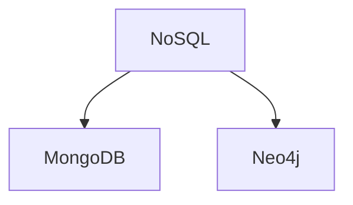

# Continuez à Apprendre ! 🚀

::left::

## 🎯 Restez connectés
- Suivre sur LinkedIn:
  - MongoDB Inc.
  - Neo4j
  - Guillaume Laforge (Dev Advocate Google)
  - Tugdual Grall (Chief Technical Advisor, MongoDB)
  - Sarah Drasner (VP Developer Experience, Netlify)

## 🎤 Podcasts Tech
- "Les Cast Codeurs"
- "If This Then Dev"
- "NoSQL Database Podcast"
- "Software Engineering Daily"

## 📅 Events Tech
- Paris.rb
- MongoDB.local Paris
- Neo4j Graph Tour
- Devoxx France
- Data Tuesday

::right::

## 🌟 Opportunités
- **Data For Good**: Projets tech à impact social
  - Participez aux saisons DFG
  - Meetups mensuels
  - [dataforgood.fr](https://dataforgood.fr)

## 🎓 Stages & Alternances
- Entreprises qui recrutent:
  - Startups: Dataiku, Contentsquare
  - Grands groupes: Orange, Société Générale
  - Cabinets: Ippon, Xebia, Zenika

## 💡 Resources
- MongoDB University (certifications gratuites)
- Neo4j GraphAcademy
- GitHub Student Pack
- Dev.to
- Medium

## 🤝 Communautés
- Discord French Dev Community
- Meetup.com
- Women in Tech
- Tech for Good

---

---
layout: section
background: https://source.unsplash.com/collection/94734566/1920x1080
---

# Compétences & Technologies
Récapitulatif du cours

---
layout: two-cols
---

# Compétences Visées

<div class="grid gap-4">

## ✅ Acquis
- Choix des bases de données adaptées
  - *Analyse des besoins*
  - *Comparaison SQL vs NoSQL*
  - *Théorème CAP & compromis*

- Manipulation via Python
  - *Drivers MongoDB & Neo4j*
  - *CRUD Operations*
  - *Agrégations & Requêtes complexes*

- Intégration Continue
  - *Tests automatisés*
  - *Github Actions*
  - *Pipeline CI/CD*

- Déploiement
  - *Conteneurisation*
  - *Cloud deployment*
  - *API & Applications*

## 🔄 En cours
- Déploiement continu des BDD
  - *Migrations automatisées*
  - *Version control pour schémas*
  - *Rollback strategies*

</div>

::right::

# Stack Technique

<div class="grid gap-2">

## 💾 Bases de données


## 🛠️ DevOps Tools
- Docker
- Github Actions
- GCP
  - Compute Engine
  - Cloud Run
  - Network(withelisting)

## 🔄 Infrastructure as Code
- Terraform
- Ansible


## 💻 Languages
```python
# Python pour la manipulation
from pymongo import MongoClient
from neo4j import GraphDatabase
```

</div>

---
layout: center
class: 'text-center'
---

# Questions ?

[Documentation](https://docs.mongodb.com) · [Tutorials](https://neo4j.com/developer) · [Resources](https://cloud.google.com/training)