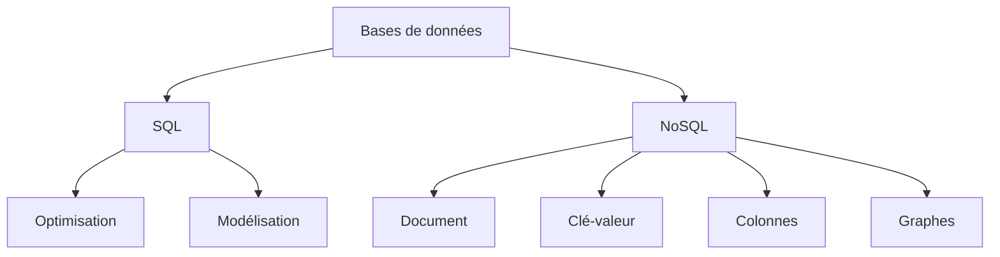

# Bases de données SQL et NoSQL
## Introduction et concepts fondamentaux

---
layout: default
---

# Plan du module

- **Cours Magistral** (1 journée)
  - Révision et approfondissement SQL
  - Introduction et concepts NoSQL

- **TD** (1/2 journée)
  - Exercices pratiques SQL et NoSQL
  
- **TP** (3.5 demi-journées)
  - Implémentation pratique
  - Cas réels d'utilisation

- **Évaluation**
  - 2 sessions de contrôle

---
layout: two-cols
---

# Objectifs d'apprentissage

<template v-slot:default>

- Maîtriser les différences entre SQL et NoSQL
- Choisir la bonne technologie selon le contexte
- Concevoir des bases de données optimisées
- Développer des compétences pratiques

</template>

<template v-slot:right>



</template>

---
layout: cover
background: './images/sql-background.jpg'
---

# Révision SQL
## Les fondamentaux

---
layout: default
---

# Le modèle relationnel

- **Structure de base**
  - Tables (relations)
  - Colonnes (attributs)
  - Lignes (tuples)

- **Caractéristiques**
  - Données structurées
  - Schema prédéfini
  - Relations entre tables
  - ACID (Atomicité, Cohérence, Isolation, Durabilité)

---
layout: two-cols
---

# Schémas et tables

<template v-slot:default>

```sql
CREATE TABLE Clients (
    id INT PRIMARY KEY,
    nom VARCHAR(50),
    email VARCHAR(100),
    date_inscription DATE
);

CREATE TABLE Commandes (
    id INT PRIMARY KEY,
    client_id INT,
    date_commande DATE,
    montant DECIMAL(10,2),
    FOREIGN KEY (client_id) 
    REFERENCES Clients(id)
);
```

</template>

<template v-slot:right>

- **Structure rigide**
  - Types de données définis
  - Contraintes d'intégrité
  - Relations explicites

- **Avantages**
  - Données cohérentes
  - Intégrité référentielle
  - Requêtes complexes

</template>

---
layout: default
---

# Normalisation

### Pourquoi normaliser ?
- Éviter la redondance
- Maintenir l'intégrité
- Faciliter la maintenance

### Les formes normales principales
1. **1NF**: Valeurs atomiques
2. **2NF**: Dépendances fonctionnelles
3. **3NF**: Pas de dépendances transitives

---
layout: two-cols
---

# Exemple de normalisation

<template v-slot:default>

**Non normalisé**
```sql
Commandes(
    id,
    client_nom,
    client_email,
    produits[],
    total
)
```

**Normalisé (3NF)**
```sql
Clients(
    id,
    nom,
    email
)

Commandes(
    id,
    client_id,
    total
)

Produits_Commande(
    commande_id,
    produit_id,
    quantite
)
```

</template>

<template v-slot:right>

### Avantages
- Moins de redondance
- Mise à jour simplifiée
- Meilleure intégrité

### Points d'attention
- Performance des jointures
- Complexité des requêtes
- Balance avec les besoins

</template>

---
layout: two-cols
---

# Contraintes d'intégrité

<template v-slot:default>

### Types de contraintes

- **PRIMARY KEY**
  - Identifiant unique
  - Non null
  - Une seule par table

- **FOREIGN KEY**
  - Référence une PRIMARY KEY
  - Assure la cohérence référentielle

- **UNIQUE**
  - Valeurs uniques
  - Peut être null
  - Plusieurs par table

</template>

<template v-slot:right>

### Autres contraintes

- **NOT NULL**
  - Valeur obligatoire

- **CHECK**
  - Validation personnalisée
  ```sql
  CHECK (age >= 18)
  ```

- **DEFAULT**
  - Valeur par défaut
  ```sql
  DEFAULT CURRENT_TIMESTAMP
  ```

</template>

---
layout: default
---

# Types de relations

### One-to-One (1:1)
```sql
CREATE TABLE Utilisateur (
    id INT PRIMARY KEY,
    nom VARCHAR(50)
);

CREATE TABLE Profil (
    id INT PRIMARY KEY,
    utilisateur_id INT UNIQUE,
    bio TEXT,
    FOREIGN KEY (utilisateur_id) 
    REFERENCES Utilisateur(id)
);
```

### One-to-Many (1:N)
```sql
CREATE TABLE Auteur (
    id INT PRIMARY KEY,
    nom VARCHAR(50)
);

CREATE TABLE Livre (
    id INT PRIMARY KEY,
    titre VARCHAR(100),
    auteur_id INT,
    FOREIGN KEY (auteur_id) 
    REFERENCES Auteur(id)
);
```

### Many-to-Many (N:M)
```sql
CREATE TABLE Etudiant (
    id INT PRIMARY KEY,
    nom VARCHAR(50)
);

CREATE TABLE Cours (
    id INT PRIMARY KEY,
    titre VARCHAR(100)
);

CREATE TABLE Inscription (
    etudiant_id INT,
    cours_id INT,
    date_inscription DATE,
    PRIMARY KEY (etudiant_id, cours_id),
    FOREIGN KEY (etudiant_id) REFERENCES Etudiant(id),
    FOREIGN KEY (cours_id) REFERENCES Cours(id)
);
```

---

---
layout: center
class: text-center
---

# Questions ?

Passons aux exercices pratiques...