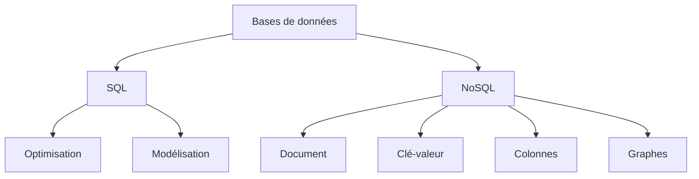
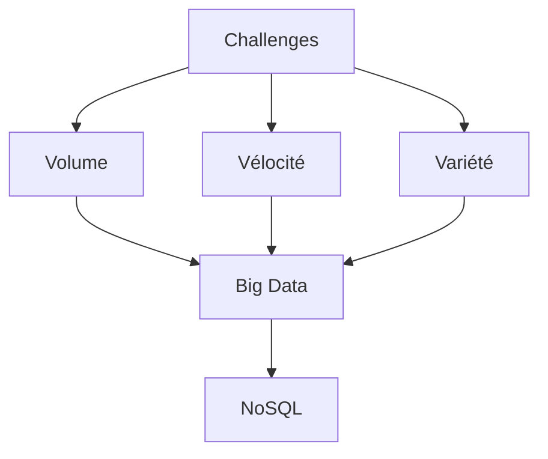
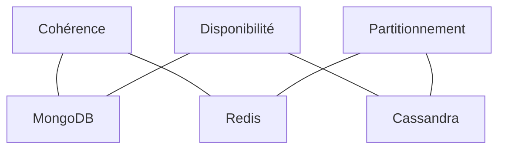
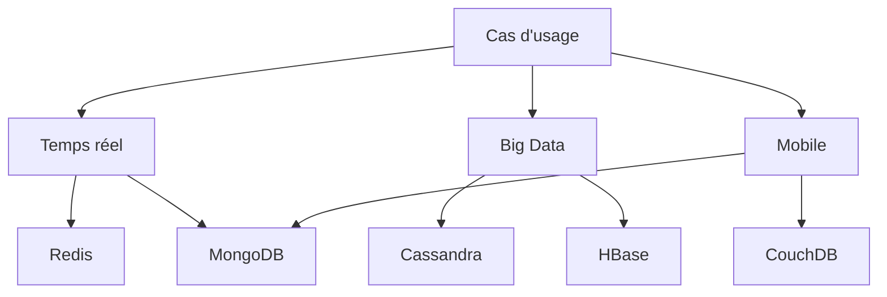

# Bases de données SQL et NoSQL
## Introduction et concepts fondamentaux

---
layout: default
---

# Plan du module

- **Cours Magistral** (1 journée)
  - Révision et approfondissement SQL
  - Introduction et concepts NoSQL

- **TD** (1/2 journée)
  - Exercices pratiques SQL et NoSQL
  
- **TP** (3.5 demi-journées)
  - Implémentation pratique
  - Cas réels d'utilisation

- **Évaluation**
  - 2 sessions de contrôle

---
layout: two-cols-header
---

# Objectifs d'apprentissage

::left::

## Notions

- Maîtriser les différences entre SQL et NoSQL
- Choisir la bonne technologie selon le contexte
- Concevoir des bases de données optimisées
- Développer des compétences pratiques

::right::




---
layout: cover
background: './images/sql-background.jpg'
---

# Révision SQL
## Les fondamentaux

---
layout: default
---

# Le modèle relationnel

- **Structure de base**
  - Tables (relations)
  - Colonnes (attributs)
  - Lignes (tuples)

- **Caractéristiques**
  - Données structurées
  - Schema prédéfini
  - Relations entre tables
  - ACID (Atomicité, Cohérence, Isolation, Durabilité)

---
layout: two-cols-header
---

# Schémas et tables 

::right::

```sql
CREATE TABLE Clients (
    id INT PRIMARY KEY,
    nom VARCHAR(50),
    email VARCHAR(100),
    date_inscription DATE
);

CREATE TABLE Commandes (
    id INT PRIMARY KEY,
    client_id INT,
    date_commande DATE,
    montant DECIMAL(10,2),
    FOREIGN KEY (client_id) 
    REFERENCES Clients(id)
);
```

::left::
- **Structure rigide**
  - Types de données définis
  - Contraintes d'intégrité
  - Relations explicites

- **Avantages**
  - Données cohérentes
  - Intégrité référentielle
  - Requêtes complexes
---
layout: default
---

# Normalisation

### Pourquoi normaliser ?
- Éviter la redondance
- Maintenir l'intégrité
- Faciliter la maintenance

### Les formes normales principales
1. **1NF**: Valeurs atomiques
2. **2NF**: Dépendances fonctionnelles
3. **3NF**: Pas de dépendances transitives

---
layout: two-cols-header
---

# Exemple de normalisation

::left::

<div class="mb-4 mr-2">

### Table non normalisée
```sql
Commandes(
    id,
    client_nom,
    client_email,
    produits[],
    total
)
```
</div>

<div class="mb-4 mr-2">

### Tables normalisées (3NF)
```sql
Clients(
    id,
    nom,
    email
)

Commandes(
    id,
    client_id,
    total
)
```
</div>

::right::

<div class="mb-6">

### Table de liaison
```sql
Produits_Commande(
    commande_id,
    produit_id,
    quantite
)
```
</div>

<div class="mb-4">

### Bénéfices
- Moins de redondance
- Mise à jour simplifiée
- Meilleure intégrité

</div>

### Compromis
- Jointures nécessaires
- Requêtes plus complexes


---
layout: two-cols-header
---

# Contraintes d'intégrité

::left::

### Types de contraintes

- **PRIMARY KEY**
  - Identifiant unique
  - Non null
  - Une seule par table

- **FOREIGN KEY**
  - Référence une PRIMARY KEY
  - Assure la cohérence référentielle

- **UNIQUE**
  - Valeurs uniques
  - Peut être null
  - Plusieurs par table


::right::

### Autres contraintes

- **NOT NULL**
  - Valeur obligatoire

- **CHECK**
  - Validation personnalisée
  ```sql
  CHECK (age >= 18)
  ```

- **DEFAULT**
  - Valeur par défaut
  ```sql
  DEFAULT CURRENT_TIMESTAMP
  ```


---
layout: two-cols-header
---

# Types de relations

::left::


**One-to-One (1:1)**
```sql {}{class:'!children:text-xs'}
CREATE TABLE Utilisateur (
    id INT PRIMARY KEY,
    nom VARCHAR(50)
);

CREATE TABLE Profil (
    id INT PRIMARY KEY,
    utilisateur_id INT UNIQUE,
    bio TEXT,
    FOREIGN KEY (utilisateur_id) 
    REFERENCES Utilisateur(id)
);
```

---
layout: two-cols-header
---

# Types de relations
::left::

### One-to-Many (1:N)
```sql
CREATE TABLE Auteur (
    id INT PRIMARY KEY,
    nom VARCHAR(50)
);

CREATE TABLE Livre (
    id INT PRIMARY KEY,
    titre VARCHAR(100),
    auteur_id INT,
    FOREIGN KEY (auteur_id) 
    REFERENCES Auteur(id)
);
```

---
layout: two-cols-header
---

# Types de relations
::left::

### Many-to-Many (N:M)
```sql
CREATE TABLE Etudiant (
    id INT PRIMARY KEY,
    nom VARCHAR(50)
);

CREATE TABLE Cours (
    id INT PRIMARY KEY,
    titre VARCHAR(100)
);

CREATE TABLE Inscription (
    etudiant_id INT,
    cours_id INT,
    date_inscription DATE,
    PRIMARY KEY (etudiant_id, cours_id),
    FOREIGN KEY (etudiant_id) REFERENCES Etudiant(id),
    FOREIGN KEY (cours_id) REFERENCES Cours(id)
);
```

---
layout: cover
background: https://source.unsplash.com/collection/94734566/1920x1080
---

# SQL Avancé
## Optimisation et requêtes complexes

---
layout: two-cols-header
---

# Techniques d'indexation

::left::

### Types d'index
- B-tree (par défaut)
- Hash
- Bitmap
- Index partiels
- Index composites

### Avantages
- Accès rapide aux données
- Optimisation des requêtes
- Performances des jointures

::right::

```sql
-- Index B-tree simple
CREATE INDEX idx_nom 
ON employes(nom);

-- Index composite
CREATE INDEX idx_nom_dept 
ON employes(departement, nom);

-- Index partiel
CREATE INDEX idx_salaire 
ON employes(salaire) 
WHERE salaire > 50000;
```

---
layout: two-cols-header
---

# Analyse des performances

::left::

### Plan d'exécution
```sql
EXPLAIN ANALYZE
SELECT e.nom, d.nom_dept
FROM employes e
JOIN departements d 
  ON e.dept_id = d.id
WHERE e.salaire > 50000;
```

### Points clés
- Coût estimé
- Temps réel
- Nombre de lignes
- Méthode de scan

::right::

<div class="mb-4">

### Optimisations courantes
- Choix des index
- Réécriture des requêtes
- Statistiques à jour
- Configuration du serveur

</div>

<div>

### Indicateurs
- Sequential scan vs Index scan
- Nested Loop vs Hash Join
- Temps de planification
- Temps d'exécution

</div>

---
layout: default
---

# Fonctions fenêtrées (Window Functions)

<div class="mb-6">

```sql
SELECT 
    nom,
    departement,
    salaire,
    AVG(salaire) OVER (PARTITION BY departement) as moy_dept,
    salaire - AVG(salaire) OVER (PARTITION BY departement) as diff_moyenne,
    RANK() OVER (PARTITION BY departement ORDER BY salaire DESC) as rang_salaire
FROM employes;
```

</div>

### Fonctions courantes
- ROW_NUMBER(): Numéro de ligne unique
- RANK(), DENSE_RANK(): Classement
- LAG(), LEAD(): Accès aux lignes précédentes/suivantes
- FIRST_VALUE(), LAST_VALUE(): Première/dernière valeur

---
layout: two-cols-header
---

# Common Table Expressions (CTE)

::left::

<div class="mb-4">

### Avantages
- Lisibilité améliorée
- Réutilisabilité
- Récursivité possible
- Modularité du code

</div>

```sql
WITH emp_stats AS (
    SELECT 
        departement,
        AVG(salaire) as moy_salaire,
        COUNT(*) as nb_employes
    FROM employes
    GROUP BY departement
)
SELECT * FROM emp_stats
WHERE nb_employes > 10;
```

::right::

### CTE Récursive

```sql
WITH RECURSIVE hierarchie AS (
    -- Cas de base
    SELECT id, nom, manager_id, 1 as niveau
    FROM employes
    WHERE manager_id IS NULL
    
    UNION ALL
    
    -- Partie récursive
    SELECT e.id, e.nom, e.manager_id, 
           h.niveau + 1
    FROM employes e
    JOIN hierarchie h 
        ON e.manager_id = h.id
)
SELECT * FROM hierarchie;
```

---
layout: two-cols-header
---

# Requêtes complexes

::left::

### Types de jointures
- INNER JOIN
- LEFT/RIGHT JOIN
- FULL OUTER JOIN
- CROSS JOIN

### Sous-requêtes
- Dans le SELECT
- Dans le FROM
- Dans le WHERE
- Corrélées

::right::

```sql
SELECT 
    d.nom_dept,
    (SELECT COUNT(*) 
     FROM employes e 
     WHERE e.dept_id = d.id) as nb_emp,
    (SELECT AVG(salaire) 
     FROM employes e 
     WHERE e.dept_id = d.id) as moy_salaire,
    CASE 
        WHEN (SELECT MAX(salaire) 
              FROM employes e 
              WHERE e.dept_id = d.id) > 100000 
        THEN 'Haute rémunération'
        ELSE 'Rémunération standard'
    END as categorie
FROM departements d;
```

---
layout: default
---

# Exercices pratiques

### 1. Optimisation d'une requête complexe
```sql
/* Avant optimisation */
SELECT * FROM employes 
WHERE departement IN (SELECT departement FROM employes GROUP BY departement HAVING COUNT(*) > 10);

/* Après optimisation */
WITH grands_dept AS (
    SELECT departement 
    FROM employes 
    GROUP BY departement 
    HAVING COUNT(*) > 10
)
SELECT e.* 
FROM employes e
JOIN grands_dept g ON e.departement = g.departement;
```

### 2. Analyse et amélioration des performances
- Identifiez les goulots d'étranglement
- Proposez des index pertinents
- Réécrivez les requêtes si nécessaire

---
layout: cover
background: https://source.unsplash.com/collection/94734566/1920x1080
---

# Introduction au NoSQL
## Au-delà du relationnel

---
layout: two-cols-header
---

# Pourquoi NoSQL ?

::left::

<div class="mb-6">

### Limites du SQL
- Schéma rigide
- Scalabilité verticale
- Performances avec grands volumes
- Structures complexes
- Coût des jointures

</div>

<div>

### Besoins modernes
- Données non structurées
- Scalabilité horizontale
- Haute disponibilité
- Temps réel
- Agilité de développement

</div>

::right::



---
layout: default
---

# Le théorème CAP

<div class="grid grid-cols-3 gap-4">

<div>

### Cohérence
- Tous les nœuds voient les mêmes données
- Lectures cohérentes
- Transactions ACID

</div>

<div>

### Disponibilité
- Chaque requête reçoit une réponse
- Sans erreur
- Sans garantie de fraîcheur

</div>

<div>

### Tolérance au partitionnement
- Le système continue de fonctionner
- Malgré les pertes de messages
- Ou pannes réseau

</div>

</div>

<div class="mt-8">



</div>

---
layout: two-cols-header
---

# Types de bases NoSQL

::left::

<div class="mb-6">

### Document (MongoDB)
```json
{
  "id": 1,
  "nom": "Dupont",
  "adresses": [
    {
      "type": "domicile",
      "ville": "Paris"
    },
    {
      "type": "travail",
      "ville": "Lyon"
    }
  ]
}
```

</div>

<div>

### Clé-valeur (Redis)
```bash
SET user:1:nom "Dupont"
SET user:1:email "dupont@mail.com"
HSET user:1 nom "Dupont" email "dupont@mail.com"
```

</div>

::right::

<div class="mb-6">

### Colonnes (Cassandra)
```sql
CREATE TABLE users (
  user_id uuid,
  year int,
  month int,
  events map<timestamp, text>,
  PRIMARY KEY ((user_id), year, month)
);
```

</div>

<div>

### Graphe (Neo4j)
```cypher
CREATE (u:User {name: 'Dupont'})
CREATE (p:Post {title: 'NoSQL'})
CREATE (u)-[:AUTHORED]->(p)
```

</div>

---
layout: two-cols-header
---

# Modélisation NoSQL

::left::

<div class="mb-4">

### Principes clés
- Dénormalisation acceptée
- Pas de schéma fixe
- Données imbriquées
- Optimisé pour les lectures
- Duplication stratégique

</div>

<div>

### Patterns courants
- Embedded Documents
- References
- Buckets
- Extended Reference
- Subset Pattern

</div>

::right::

```javascript
// Document MongoDB
{
  "_id": "commande123",
  "client": {
    "id": "client456",
    "nom": "Dupont",
    "email": "dupont@mail.com"
  },
  "produits": [
    {
      "id": "prod789",
      "nom": "Laptop",
      "prix": 999.99,
      "quantite": 1
    }
  ],
  "total": 999.99,
  "statut": "en cours",
  "date": "2024-01-21"
}
```

---
layout: default
---

# Comparaison SQL vs NoSQL

<div class="grid grid-cols-2 gap-4">

<div>

### SQL
- Schéma fixe
- Relations
- Transactions ACID
- Jointures
- Scalabilité verticale
- Requêtes complexes
- Cohérence forte

</div>

<div>

### NoSQL
- Schéma flexible
- Documents imbriqués
- BASE (Basic Availability)
- Dénormalisation
- Scalabilité horizontale
- Requêtes simples
- Cohérence éventuelle

</div>

</div>

<div class="mt-6">

### Critères de choix
1. Nature des données (structurées vs non structurées)
2. Volume et croissance prévue
3. Patterns d'accès (lectures vs écritures)
4. Besoins en cohérence
5. Expertise de l'équipe

</div>

---
layout: two-cols-header
---

# Cas d'usage

::left::

<div class="mb-4">

### Applications idéales
- Réseaux sociaux
- IoT / Big Data
- Logging
- E-commerce
- Temps réel
- Contenu mobile

</div>

<div>

### Exemples concrets
- Facebook : Cassandra
- LinkedIn : MongoDB
- Twitter : Redis
- Amazon : DynamoDB

</div>

::right::

