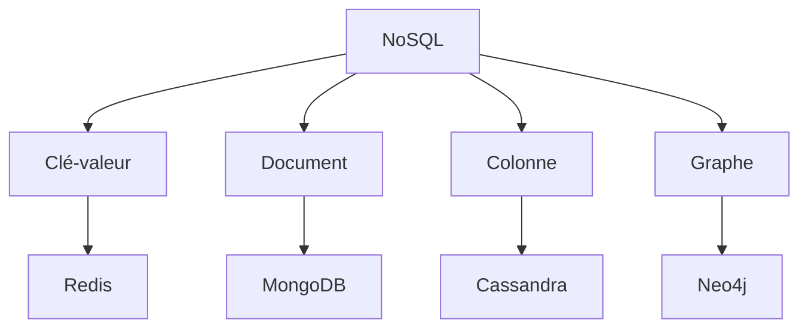
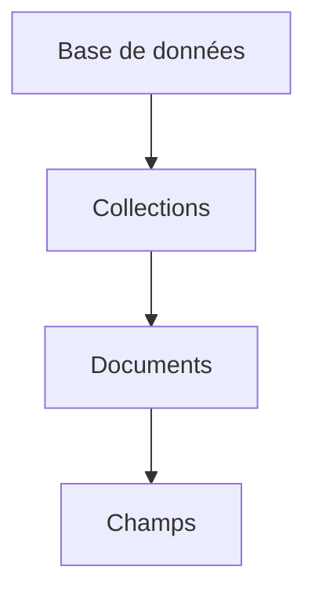
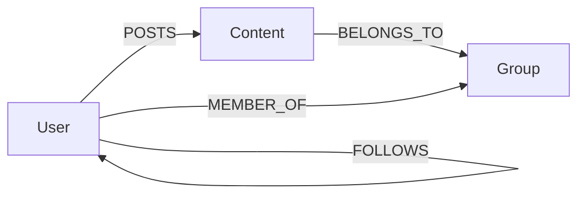

# Bases de données NoSQL
Révision Complète

---
layout: default
---

# Plan du cours

<v-clicks>

- Concepts Fondamentaux
- Types de Bases NoSQL
- MongoDB en détail
- Neo4j et bases de données graphes
- Cas pratiques
- Exercices type examen

</v-clicks>

---
layout: two-cols
---

# Concepts Fondamentaux

<v-clicks>

## Propriétés BASE
- **B**asically Available
- **S**oft State
- **E**ventually Consistent

</v-clicks>

::right::

<v-clicks>

## Théorème CAP
- Consistency
- Availability
- Partition Tolerance

</v-clicks>

---
layout: center
---

# Types de Bases NoSQL



---
layout: default
---

# MongoDB en détail

<v-clicks>

## Structure hiérarchique


## Opérations CRUD
```js
// Create
db.collection.insertOne()
// Read
db.collection.find()
// Update
db.collection.updateOne()
// Delete
db.collection.deleteOne()
```

</v-clicks>

---
layout: two-cols
---

# Requêtes MongoDB

<v-clicks>

## Opérateurs de comparaison
```js
// Égal
{field: {$eq: value}}
// Différent
{field: {$ne: value}}
// Supérieur
{field: {$gt: value}}
```

</v-clicks>

::right::

<v-clicks>

## Exemple pratique
```js
db.users.find({
  age: {$gte: 18},
  city: "Paris"
})
```

</v-clicks>

---
layout: center
---

# Write Concerns

<div class="grid grid-cols-3 gap-4">
<div v-click>

## w: 0
- Sans accusé
- Performance maximale
- Risque de perte

</div>
<div v-click>

## w: 1
- Primary only
- Compromis standard
- Bon pour dev

</div>
<div v-click>

## w: "majority"
- Majorité des nœuds
- Plus sécurisé
- Production

</div>
</div>

---
layout: default
---

# Neo4j

<v-clicks>

## Éléments de base
```cypher
// Création d'un nœud
CREATE (p:Person {name: 'John'})

// Création d'une relation
MATCH (a:Person), (b:Person)
WHERE a.name = 'John' AND b.name = 'Jane'
CREATE (a)-[:FOLLOWS]->(b)
```

## Requêtes simples
```cypher
// Trouver des amis d'amis
MATCH (p:Person)-[:FOLLOWS]->(:Person)-[:FOLLOWS]->(fof:Person)
WHERE p.name = 'John'
RETURN DISTINCT fof.name
```

</v-clicks>

---
layout: center
---

# Optimisation Neo4j

<div class="grid grid-cols-2 gap-4">
<div v-click>

## ✅ Bonnes pratiques
- Utiliser les labels
- Indexer les propriétés clés
- Patterns restrictifs d'abord

</div>
<div v-click>

## ❌ À éviter
- Parcours complet du graphe
- Requêtes sans labels
- Relations non indexées

</div>
</div>

---
layout: default
---

# Cas Pratique : Réseau Social

<v-clicks>

## Modélisation


## Considérations
- Choix du type de base
- Compromis CAP
- Stratégie de scaling
- Cohérence vs Disponibilité

</v-clicks>

---
layout: center
class: text-center
---

# Questions d'examen types

<div class="grid grid-cols-2 gap-4 mt-4">
<div v-click>

## Théorique
- QCM sur les concepts
- Questions de cours
## Pratique
- Exercice Mongo
- Exercice Neo4j

</div>

</div>

---
layout: end
---

# Merci !

[Documentation MongoDB](https://docs.mongodb.com) · [Documentation Neo4j](https://neo4j.com/docs/)